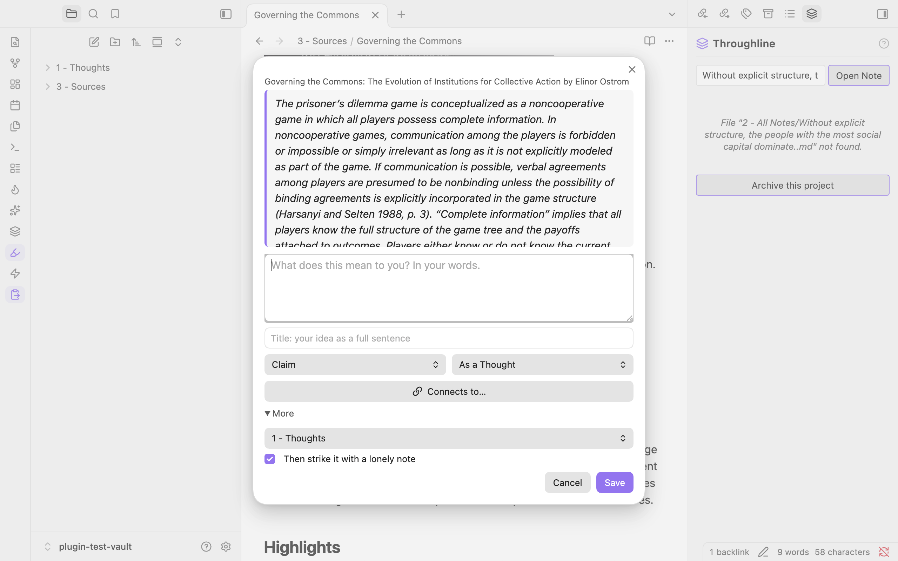

# Distill

A Zettelkasten companion: distill what you read into atomic notes in your own words, link them on purpose, and strike notes together for new ideas.

*(Formerly called Flint.)*

Distill does two things. **Distill** turns something you read into a note in your own words. **Strike** puts two of your notes side by side so you can write the idea neither one contains alone.


I built Strike (it was the whole plugin at first, back when it was called Flint) because I had hundreds of notes and no idea what they meant together. I'd browse my vault and see the same familiar paths every time. Strike fixes that by picking two notes at random, putting them side by side, and asking: *what does this combination make you think?*

Sometimes nothing. Skip, shuffle, try again. But sometimes two notes that have no business being next to each other produce an idea that neither one contains alone. That's the spark. You write it down, it becomes a new note, and it links back to its parents.

This is basically the first thing I've ever coded. It's simple and it's fun and I use it all the time.

## Distill: from a passage to your own note



1. **Select a passage** in any note (Readwise highlights, web clippings, PDF++ quotes) or right inside a PDF
2. **Distill it** with the ✨ ribbon icon, the right-click menu, or the command `Distill: Turn selection into a note`
3. **Write what it means to you.** The passage stays pinned at the top while you write
4. **Pick a type** (claim, concept, quote, anecdote) and give it a title, ideally your idea as one full sentence
5. **Connect it on purpose** with "Connects to…": pick the note this one continues, contradicts or refines, and say how in a line. Both notes get linked
6. **Save** as its own note, or **as a note on the source** if it's not a full idea yet. Notes on a source can be promoted later: right-click the line → **Promote to its own note**

Distilled notes keep the quote, the source, the author and a link back to the exact spot (a Readwise highlight or the PDF page). Tick "Then strike it" and the Strike window opens with your new note paired against a lonely one.

## Strike: two notes, one new idea

1. **Open Strike** — Command palette (`Distill: Strike two notes`) or the flame icon in the ribbon
2. **Read the pair** — Two random notes side by side
3. **Shuffle or pick** — Swap either note for a new random one, or search for something specific
4. **Write the spark** — Type the idea the collision gave you
5. **Save** — New note with backlinks to both parents

Saved sparks look like this:

```markdown
---
type: claim
origin: strike
created: 2026-10-07
---

Your original idea goes here.

---

## Sparked from

- [[Note A]]
- [[Note B]]
```

## The orphan thing

Strike can weight its randomness toward notes with fewer connections (links in or out) — the ones you haven't linked to much, the ones gathering dust. Turns out those are often the most surprising ones to collide. Your most neglected notes might be your best material. Toggle this in settings.

## Other details

- Won't repeat notes you've already seen (resets when it runs out)
- Scope to a specific folder if you want, or let it roam the whole vault
- `Cmd/Ctrl+Enter` to save without reaching for the mouse
- Click the notification after saving to jump straight to your new note
- Drag the corner to resize the dialog

## Install

### From Community Plugins

1. Open **Settings > Community Plugins** in Obsidian
2. Search for **Distill**
3. Click **Install**, then **Enable**

### Manual

1. Download `main.js`, `manifest.json`, and `styles.css` from the [latest release](https://github.com/MaggieMcgu/obsidian-distill/releases)
2. Create a folder called `distill` in your vault's `.obsidian/plugins/` directory
3. Copy the three files into it
4. Enable the plugin in **Settings > Community Plugins**

## Companion plugin

Sister plugin to [Throughline](https://github.com/MaggieMcgu/obsidian-note-assembler), an essay composer. Distill makes the ideas; Throughline arranges them into an essay. If Throughline is installed, Distill and Strike can drop a new note straight into one of your essays.

I'd love to hear how you use it, what's broken, or what would make it better. Open an [issue](https://github.com/MaggieMcgu/obsidian-distill/issues) or find me at [moabsunnews.com](https://moabsunnews.com).

## Support

Distill is free and open source. If it sparks something good, tips are welcome on [Venmo](https://venmo.com/KiKiBouba).

## License

[MIT](LICENSE)
